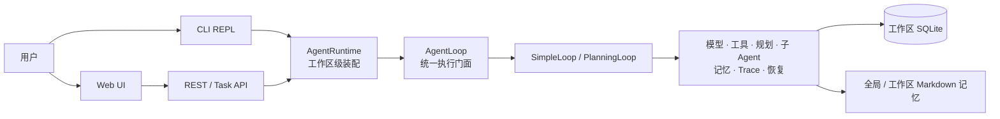

# One Agent：Agent 项目接手指南

> 文档状态：维护中
> 最后更新：2026-07-26
> 读者：首次接手仓库的开发 Agent 与维护者

这是一份面向“马上要开始改代码”的导航。它解释当前系统如何连接、规则应落在哪一层、
修改后如何验证。产品边界和完整现状仍以
[《项目目标、愿景与设计现状》](./project-vision-and-status.md)为准。

## 1. 五分钟建立项目模型

One Agent 是一个模型无关、可靠性优先的本地 Agent Runtime。它有多个入口，但只有一套执行核心：



最重要的判断是：**需求是在改变 Agent 的能力，还是只改变使用方式？**

- 改变模型调用、规划、委派、预算、工具、安全、记忆、Trace 或恢复：修改
  `packages/agent-core`，Web 与 CLI 自动共用。
- 改变页面布局、终端格式、HTTP 传输或工作区选择器：修改对应 `apps/*`。
- 如果一个行为在 Web 和 CLI 中应一致，却必须分别实现两次，通常说明分层位置不对。

## 2. 仓库地图

### 2.1 在线执行核心

`packages/agent-core` 是项目最重要的包：

| 子目录 | 作用 |
| --- | --- |
| `src/runtime` | `AgentRuntime` 工作区级 Composition Root |
| `src/agents` | `AgentLoop`、模型/工具调用、Run 记录、事件、恢复、子 Agent |
| `src/agents/loops` | SimpleLoop、PlanningLoop 与计划执行 |
| `src/planning` | Planner、TaskJudge、ReasoningChain、计划确认、DelegationPolicy |
| `src/model` | OpenAI Compatible、Anthropic、Fallback、能力契约、诊断、token 预算 |
| `src/tools` | Tool Registry、执行器、Sandbox、审批策略、内置工具 |
| `src/context` | 上下文窗口、摘要、持久化消息装配 |
| `src/memory` | Markdown 长期记忆、提取、显式记忆工具 |
| `src/db` | SQLite 连接、迁移和各类 Store |
| `src/tasks` | 持久化异步任务队列与 Worker |

### 2.2 交互入口

| 路径 | 作用 | 边界 |
| --- | --- | --- |
| `apps/cli` | 全局命令、REPL、恢复/审批输入、终端事件展示 | 不拥有独立 Agent 规则 |
| `apps/api` | Fastify、Web API、异步任务、工作区 Runtime 注册 | 路由不复制 core 业务规则 |
| `apps/web` | 本地聊天、执行详情、Trace、设置页面 | 只消费后端状态 |
| `apps/trace-web` | 独立 Trace Viewer | Run/Trace 只读且不参与执行；Memory 面板可编辑记忆文档 |

### 2.3 离线验证

`packages/agent-eval` 提供数据集加载、EvalRunner 和 Completion Contract。它根据证据与工作区终态
检查结果，但不插入在线 Agent 的回答链路。

## 3. 一轮请求如何执行

### 3.1 CLI

1. `apps/cli/src/index.ts` 解析参数并加载全局/工作区配置。
2. CLI 为启动工作区创建 `AgentRuntime`。
3. `chat.ts` 建立或恢复 Thread，并通过 Runtime 创建 Agent。
4. 用户输入进入 `AgentLoop.run()`；事件实时呈现到终端。
5. 需要计划确认、工具审批或澄清时，状态与恢复点写入 Trace，下一次输入继续新的 Run。

### 3.2 Web

1. `one-agent web` 启动 API 和静态页面；启动目录不决定会话工作区。
2. 用户仅在新建会话时选择目录。
3. `WorkspaceRuntimeRegistry` 验证绝对路径，并按工作区创建/复用 Runtime 和相对数据库。
4. `/api/web/chat` 接受请求后快速返回 `202`，Agent 在后台继续执行。
5. 页面通过会话状态、Trace 与事件接口更新运行、审批、子 Agent 和最终回答。

Web 长任务必须保持异步。不要把它改回“HTTP 请求一直等到模型全部执行结束”，否则会重新引入页面无反馈、
按钮像失效、代理层超时以及无法切换会话的问题。

### 3.3 API 后台任务

`TaskQueue` / `QueueWorker` 持久化任务状态并在启动时恢复 pending/running 任务。后台 Worker 创建 Agent 时
关闭交互式输入，因此不能进入依赖用户即时回答的计划审批流程。

## 4. Agent Runtime 与 Loop

### 4.1 AgentRuntime

`packages/agent-core/src/runtime/AgentRuntime.ts` 每个工作区创建一次，持有：

- SQLite 连接与 Thread、Message、Run、ToolCall、Trace、Task Store；
- 工作区 Sandbox 和内置工具；
- MemoryDocumentStore / MemoryConsolidator；
- ToolPolicy；
- 配置的 ModelProvider 链。

`createAgent()` 为每次交互克隆工具注册表，按配置增加 `manage_memory` 和
`request_user_input`，执行模型能力预检，然后创建 `AgentLoop`。

### 4.2 三种策略

- `simple`：直接模型—工具循环，适合聊天和少量独立操作。
- `planning`：先生成结构化计划，经确认后逐步执行并支持恢复。
- `auto`：分类器先选择；SimpleLoop 在首轮出现三个以上工具调用时，可在任何工具执行前安全升级到
  PlanningLoop。

策略切换必须发生在副作用执行之前，避免升级后重放写操作。

## 5. 规划与子 Agent

### 5.1 谁负责什么

主 Agent 负责：

- 理解用户目标和约束；
- 规划工作包；
- 进行所有用户沟通和澄清；
- 执行可能产生副作用的工具；
- 汇总证据并给出最终回答。

子 Agent 负责：

- 在隔离上下文中完成一个有边界的只读调查；
- 使用筛选后的只读工具；
- 返回 Evidence Packet，包含结论、证据来源、观察值和已知缺口；
- 完成后退出，不再递归创建子 Agent。

Runtime 会把父 Run 已加载的记忆快照注入子 Agent，并移除 `manage_memory`，所以子 Agent 不能通过记忆接口
修改长期记忆。当前 workspace 文件 Sandbox 没有专门屏蔽 `.one-agent/MEMORY.md`；继承 `read_file` 时，
子 Agent 仍可能直接读取该工作区文件。全局记忆位于 workspace 外，不能通过文件工具访问。

### 5.2 version 2 工作包语义

新 Plan 的委派单元是完整工作包，不是每个原子步骤：

| 字段 | 含义 |
| --- | --- |
| `executor` | `main` 或 `subagent` |
| `checklist` | 工作包内部检查项，不各自创建子 Agent |
| `scope` / `nonGoals` | 明确调查边界和排除项 |
| `expectedOutcome` | 子 Agent 应交付的结果 |
| `expectedEvidence` | 结果必须携带的证据 |
| `delegationReason` | 为什么独立委派有价值 |
| `dependsOn` | 依赖存在时不得假装并行 |

`DelegationPolicy` 同时约束 PlanningLoop 的计划委派和 SimpleLoop 的动态 `spawn_agent`：

- 拒绝空任务；
- 拒绝把汇总或最终用户回答交给子 Agent；
- 要求清晰交付物与有意义的范围、清单或证据契约；
- 合并重复工作包；
- 将子 Agent 的嵌套 children 收敛成 checklist；
- 有依赖的任务转为非并行。

旧持久化 Plan 没有 `version`，继续按旧语义恢复，不能因为新规则而使历史 Run 无法继续。

### 5.3 当前资源保护

- `budget.mainAgentTokens`：单个主 Agent 的累计模型 token 上限；`null` 表示不限制。
- `budget.subAgentTokens`：**单个**子 Agent 的累计模型 token 上限；`null` 表示不限制。
- `subAgent.maxConcurrency`：内部同时执行的子任务上限，默认 `4`。
- `subAgent.taskTimeoutMs`：单个子任务超时，默认 `60000`。
- `subAgent.maxDepth`：委派深度保护，默认 `1`。
- `subAgent.maxToolIterations`：单个子 Agent 的工具迭代上限，默认 `5`。

当前没有“父 Run 子 Agent 总 token 预算”，也没有“子 Agent 总数量上限”。不要把旧文档里的
`50,000 token` 或 `8 个子任务` 当作现行规则。委派质量由 `DelegationPolicy` 管理，资源风险由
并发、单 Agent 预算、超时、深度和工具迭代共同保护。

## 6. 工具、安全与审批

内置工具由 `packages/agent-core/src/tools/built-in/index.ts` 集中注册。新增工具时：

1. 实现明确的输入 Schema、结果类型和错误语义。
2. 明确 `readOnly`；不能确定就按非只读处理。
3. 通过 Workspace Sandbox 约束路径和 cwd。
4. 在集中工厂注册，并补工具、策略和集成测试。
5. 同步 README 的内置工具说明。

同一模型响应中的工具调用会作为一个批次进入执行层。只有整批都明确
`readOnly: true` 时才能并行；包含写工具、未知工具或未声明属性时保持串行，结果仍按模型原调用顺序
写入上下文和 Trace。

危险工具由 `ToolPolicy` 生成带冻结参数和指纹的持久化审批。计划确认只批准“是否按该计划开始”，
不等于批准之后每一个危险命令。

## 7. 持久化、Trace 与恢复

SQLite 当前保存 Thread、Message、Agent Run、Trace Event、Task 和 Tool Call。迁移集中在
`packages/agent-core/src/db/connection.ts`，必须可以从旧数据库安全升级。

关键规则：

- Thread 不带 workspace 字段；工作区通过所使用的 Runtime 和数据库自然隔离。
- 普通 Trace 是观测信息，写失败时 Run 可继续但要标记 Trace 不完整。
- `recovery_point` 是继续执行必需的事实，写失败时不能推进成可恢复成功状态。
- PlanningLoop 恢复会创建新 Run，并从第一个未完成步骤继续。
- 只读工具可安全重试；副作用工具状态不确定时进入 `recovery_required`，不能自动重放。
- Trace 查询和页面展示必须遵守 `metadata` / `redacted` / `full` 内容策略。

新增 Trace 事件通常需要同时检查：

1. core 事件类型和记录位置；
2. trace sanitizer；
3. Store 序列化/反序列化；
4. API 返回结构；
5. Web / Trace Viewer 展示；
6. 正常、失败、旧记录缺字段测试。

## 8. 记忆

长期记忆由用户可直接编辑的 Markdown 文件拥有：

```text
~/.one-agent/GLOBAL_MEMORY.md
<workspace>/.one-agent/MEMORY.md
```

主 Agent 每轮读取相关记忆上下文，但普通对话不额外调用一次记忆模型。CLI 在会话切换、正常退出和启动恢复时
整理尚未提取的会话；API/Web 在工作区 Runtime 创建或路由初始化时恢复未提取会话，当前不在浏览器每次切换
会话时立即整理。用户明确要求“记住 / 修正 / 忘记 / 查询记忆”时，`manage_memory` 可在当前工具循环立即操作。

记忆文件使用写锁、临时文件、原子替换和 hash 冲突检测。凭据不可进入长期记忆，Trace 也不复制记忆正文。

## 9. 模型、配置与预算

模型抽象支持 OpenAI Compatible、Anthropic Messages 和跨协议 Fallback。Provider 必须声明
streaming、toolCalling、structuredOutput、reasoning 和可选上下文窗口能力；Runtime 在执行前做能力预检，
不能静默降级。

配置加载顺序和全部默认值见
[《配置清单》](./configuration-reference.md)。修改配置时至少同步：

1. `packages/agent-core/src/config.ts`；
2. 必要的 `configAccess.ts` 兼容默认值；
3. `one-agent.config.example.json`；
4. `docs/configuration-reference.md`；
5. core 配置测试；
6. 若 Web 可编辑，还要更新 settings API、脱敏逻辑和设置页面。

API Key 不应明文返回浏览器。配置变更从下一次任务生效，不应替换正在运行或等待审批的 Agent。

## 10. 常见改动路线

### 10.1 修改所有入口共用的 Agent 行为

从 `AgentRuntime` → `AgentLoop` → 对应 Loop/执行器向下追踪。行为放 core，给 core 增加测试，再验证
CLI 和 Web 至少各一条集成路径。

### 10.2 增加一个内置工具

修改 `packages/agent-core/src/tools/built-in` 和集中注册；补 Sandbox、readOnly、审批与错误路径测试。
不要在 API 路由或 Web 浏览器里直接执行该能力。

### 10.3 增加配置项

先定义所属层和 `null` / 缺省语义，再修改 Schema、访问器、示例、配置文档和测试。Web 可编辑项还要处理
API Key 等敏感字段的“保留但不回显”行为。

### 10.4 调整 Web UX

优先修改 `apps/web/src/app.js` 与 `styles.css`。页面应：

- 用持久化状态恢复运行中、等待审批和等待输入；
- 长内容局部折叠，主页面保持可滚动；
- 只有用户停留在底部时自动跟随新消息；
- 提交按钮立即进入 pending 状态并给反馈；
- 子 Agent 一行一个工作包，展开后显示委派任务、工具、证据和缺口；
- 不展示无语义的 `pending` 计划步骤占据主信息区域。

若页面缺少事实，先让 core/API 暴露结构化状态，不要用文案解析推断。

### 10.5 修改数据库

在 `connection.ts` 增加幂等迁移，Store 屏蔽 SQL 细节，补新库和旧库升级测试。避免给 Thread 增加可由
工作区数据库边界表达的冗余 workspace 字段。

### 10.6 增加模型 Provider

实现 `ModelProvider`，声明真实能力，接入 factory、凭据清理、诊断与 fallback 最弱能力合并，并使用
mock/fixture 覆盖流式、工具调用、错误分类、重试和 token 用量。

## 11. 验证矩阵

| 改动范围 | 最低验证 |
| --- | --- |
| core 单模块 | 相邻单测 + `pnpm --filter @one-agent/agent-core build` |
| 规划/恢复/数据库 | core 相关测试 + core 全测 + 旧数据兼容用例 |
| CLI | CLI 测试 + CLI build；必要时真实 REPL 冒烟 |
| API | API 路由测试 + API build |
| Web | Web 测试 + Web build + 浏览器交互冒烟 |
| 跨 core/API/Web | 各层聚焦测试后运行 `pnpm test`、`pnpm build` |
| Eval 合同 | agent-eval 测试；需要时运行指定数据集，不默认消耗真实模型费用 |
| 纯文档 | 链接/路径核对 + `git diff --check` |

根脚本：

```bash
pnpm build
pnpm test
pnpm eval
pnpm eval:recovery
```

不要用固定的“当前测试数量”判断是否完整；测试数量会持续变化，以命令实际结果为准。

## 12. 常见排障

### 配置文件不存在

全局安装后先执行 `one-agent --init`，配置默认位于
`~/.one-agent/one-agent.config.json`。某工作区的 `one-agent.config.json` 只用于显式项目覆盖，
不是每个目录都必须创建。

### Web 仍显示旧代码

先确认源代码已 build，再重新执行 `one-agent web`。启动器只会停止能够确认为 One Agent 的旧进程；
端口被其他程序占用时不会强行终止。

### 页面提交后像没有反应

检查请求是否使用 `/api/web/*` 异步路由、是否快速返回 `202`，以及 Run/Trace 是否持续更新。
不要通过增加更长的同步超时掩盖问题。

### 等待审批但找不到按钮

以持久化的 pending input / recovery point 为事实源，检查 API 是否返回当前输入类型、页面是否把审批卡片
放在可见滚动区域，以及刷新后能否恢复。不要只检查输入框 disabled 状态。

### 页面总被拉回底部

检查自动滚动是否基于“用户发送新消息”或“用户仍接近底部”，而不是对每一条流式/Trace 事件无条件执行。

### 子 Agent 预算耗尽

先区分是主 Agent 预算还是某一个子 Agent 的预算。当前没有共享的父 Run 子 Agent 总 token 池；
不要把多个子 Agent 的 token 累加后按旧 `50,000` 限制报错。

## 13. 交接模板

完成任务时给下一位维护者留下：

```text
目标：
改动：
所属层：core / CLI / API / Web / Trace Web / Eval
关键文件：
共享影响：Web / CLI / API 是否同时生效
数据兼容：Schema、旧 Trace、恢复点是否变化
验证：
未解决限制：
```

如实现改变了产品能力或架构，请在同一次改动中更新
`project-vision-and-status.md`；如改变启动或使用方式，同时更新根 README。阶段过程、修复流水账和
一次性审查由 Git 历史、测试与 Trace 保存，不再额外创建长期“完成报告”。
